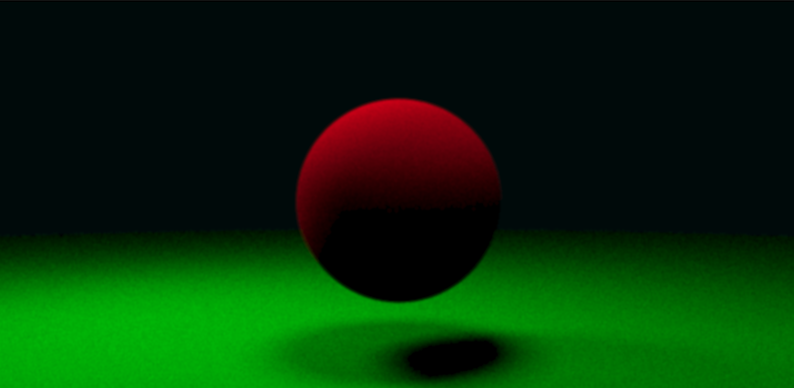

# 🌟 RayTracing

> A high-performance C++ ray tracing engine that generates photorealistic images using Monte Carlo path tracing

This project implements a CPU-based ray tracer with support for various materials, realistic lighting, and geometric primitives, producing stunning rendered images with physically-based accuracy.

## 📸 Gallery

<div align="center">
  
  <br>
  <em>Sample render showcasing Lambertian Sphere</em>
</div>

---

## ✨ Features

### 🎯 Core Ray Tracing
- **Monte Carlo Path Tracing**: High-quality rendering with configurable samples per pixel
- **Physically-Based Materials**: Support for multiple material types with realistic light interaction
- **Anti-aliasing**: Multi-sampling for smooth, high-quality images
- **Recursive Ray Bouncing**: Configurable maximum ray depth for realistic lighting

### 🎨 Materials
- **🏐 Lambertian**: Diffuse materials for matte surfaces
- **🪞 Metal**: Reflective surfaces with configurable fuzziness
- **💎 Dielectric**: Glass-like materials with refraction and reflection
- **💡 Emissive**: Light-emitting materials for illumination

### 📐 Geometry
- **⚪ Spheres**: Primary geometric primitive with material assignment
- **📋 HittableList**: Scene management for multiple objects
- **🎯 Hit Testing**: Efficient ray-geometry intersection calculations

### 📷 Camera System
- **🔭 Perspective Camera**: Configurable field of view and aspect ratio
- **🎯 Flexible Positioning**: Look-at system with customizable up vector
- **📡 Ray Generation**: Generates camera rays for each pixel

### 🖼️ Rendering
- **🖼️ PPM Image Output**: Standard image format for rendered results
- **⏱️ Performance Timing**: Built-in render time measurement
- **📏 Configurable Resolution**: Customizable image dimensions
- **🌈 Background Control**: Adjustable background colors

## 📂 Project Structure

```
RayTracing/
├── src/
│   ├── main.cpp              # Main application entry point
│   ├── core/                 # Core ray tracing components
│   │   ├── Vec3.*            # 3D vector mathematics
│   │   ├── Ray.*             # Ray class for ray casting
│   │   └── Camera.*          # Camera system
│   ├── geometry/             # Geometric primitives
│   │   ├── Hittable.h        # Base class for hittable objects
│   │   ├── HitRecord.h       # Ray-object intersection data
│   │   ├── HittableList.*    # Scene object container
│   │   └── Sphere.*          # Sphere primitive implementation
│   ├── materials/            # Material system
│   │   ├── Material.h        # Base material interface
│   │   ├── Lambertian.*      # Diffuse material
│   │   ├── Metal.*           # Metallic material
│   │   ├── Dielectric.*      # Glass/transparent material
│   │   └── Emissive.*        # Light-emitting material
│   ├── render/               # Rendering system
│   │   ├── Renderer.*        # Main rendering engine
│   │   └── Image.*           # Image handling
│   ├── gpu/                  # GPU rendering (placeholder)
│   │   └── raytracer.cu      # CUDA implementation (empty)
│   └── utils/                # Utility functions
├── tests/                    # Unit tests
├── include/                  # Additional headers
├── scenes/                   # Scene configuration files
├── docs/                     # Documentation
└── build/                    # Build output directory
```

## ⚙️ Requirements

### 🔧 Build Dependencies
- **CMake 3.29+**: Build system
- **C++20 Compatible Compiler**: GCC, Clang, or MSVC
- **SFML 3.0.1**: Graphics library (automatically downloaded)

### 🏃‍♂️ Runtime Dependencies
- **SFML Libraries**: Graphics, Window, and System modules

## 🔨 Building the Project

### 📋 Prerequisites
Make sure you have the following installed:
- CMake 3.29 or higher
- A C++20 compatible compiler
- Git (for dependency fetching)

### 🚀 Build Steps

1. **📥 Clone the repository:**
   ```bash
   git clone https://github.com/RadaanMadhan/RayTracing.git
   cd RayTracing
   ```

2. **📁 Create and navigate to build directory:**
   ```bash
   mkdir build
   cd build
   ```

3. **⚙️ Configure with CMake:**
   ```bash
   cmake ..
   ```

4. **🔨 Build the project:**
   ```bash
   cmake --build .
   ```

### 🎯 Build Targets
- `raytracer`: Main executable for ray tracing
- `raytracer_lib`: Static library with core functionality
- Test executables: `Vec3_tests`, `Ray_tests`, `Camera_tests`, `Sphere_tests`

## 🚀 Usage

### ▶️ Running the Ray Tracer
After building, run the main executable from the build directory:

```bash
./src/raytracer        # On Linux/Mac
.\src\raytracer.exe    # On Windows
```

The program will:
1. Initialize a scene with spheres and materials
2. Set up a camera with configurable parameters
3. Render the scene using Monte Carlo sampling
4. Output the result as `render.ppm`
5. Display render time statistics

### ⚙️ Configuration
The main rendering parameters can be modified in `src/main.cpp`:

```cpp
constexpr int imageWidth = 800;      // Image width in pixels
constexpr int imageHeight = 400;     // Image height in pixels
constexpr int samplesPerPixel = 200; // Anti-aliasing samples
constexpr int maxDepth = 50;         // Maximum ray bounce depth
```

### 📷 Camera Settings
```cpp
const Vec3 origin(0, 0, -5);         // Camera position
const Vec3 lookAt(0, 0, 0.5);        // Look at point
const Vec3 up(0, 1, 0);              // Up vector
float fov = 40 * M_PI / 180;         // Field of view in radians
```

## 🧪 Testing

The project includes comprehensive unit tests using Google Test:

### 🏃‍♂️ Running Tests
```bash
cd build
ctest                    # Run all tests
./tests/Vec3_tests       # Run specific test suite
```

### 📊 Test Coverage
- **Vec3 Tests**: Vector mathematics operations
- **Ray Tests**: Ray creation and manipulation
- **Camera Tests**: Camera ray generation
- **Sphere Tests**: Sphere-ray intersection

## 🖼️ Output

The ray tracer generates images in PPM format (`render.ppm`). This format can be:
- Viewed with image viewers that support PPM
- Converted to other formats using tools like ImageMagick:
  ```bash
  convert render.ppm render.png
  ```

## ⚡ Performance

### 🖥️ Current Implementation
- **CPU-based rendering**: Single-threaded Monte Carlo path tracing
- **Typical render times**: Varies based on resolution and sample count
- **Memory usage**: Minimal, suitable for complex scenes

### 🚀 Future Improvements
- GPU acceleration using CUDA (framework in place)
- Multi-threading support
- Acceleration structures (BVH, etc.)
- Additional geometric primitives

## 🤝 Contributing

1. 🍴 Fork the repository
2. 🌿 Create a feature branch
3. 🧪 Add tests for new functionality
4. ✅ Ensure all tests pass
5. 📝 Submit a pull request

## 📄 License

This project is open source. Please check the repository for license details.

## 🙏 Acknowledgments

This ray tracing implementation is inspired by:
- 📚 "Ray Tracing in One Weekend" series by Peter Shirley
- 📖 "Physically Based Rendering" by Pharr, Jakob, and Humphreys
- 🔬 Real-time rendering techniques and Monte Carlo methods

---

<div align="center">
  <strong>Made with ❤️ and lots of ☕</strong>
  <br>
  <em>Happy Ray Tracing! 🌟</em>
</div>